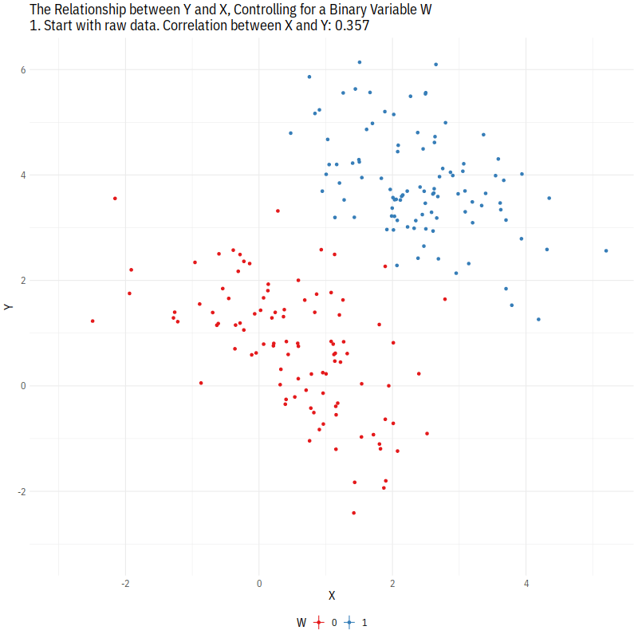

```{r setup, include=FALSE}
knitr::opts_chunk$set(echo = TRUE, message=FALSE, warning=FALSE, fig.align = 'center')
```
\newcommand{\y}{\mathbf{y}}
\newcommand{\X}{\mathbf{X}}
\newcommand{\E}{\mathbb{E}}
\newcommand{\V}{\mathbb{V}}
\newcommand{\independent}{\perp\!\!\!\perp}

I develop this document largely based on materials from the previous TAs for PS 200C, Doeun Kim and Soonhong Cho. 

## Selection on Observables

***

 - Goal: once we condition on some pre-treatment observable covariates, treatment is as-if random assignment. 

 - We invoke the **<span style="color:red;">conditional ignorability</span>** (selection on observables; SOO) assumption: $$ \{ Y_{0i}, Y_{1i} \} \independent D_i|X_i=x \; \text{ for any } \; x \in \chi,$$ which means that "among units with same values of covariates $X_i$, $D_i$ is "as-if" randomly assigned. In other words, the conditional distribution of potential outcomes is identical across levels of the treatment once we condition on the covariates $X$ (recall stratified/block randomized experiment, or "conditional experiment": "we effectively run a separate experiment within each stratum of $X$", but now allowing for continuous $X$s). Similarly, we have weaker versions of the conditional $\{Y_{1i} \} \independent D_i|X_i=x \; \text{ for any } \; x \in \chi$ or $\{ Y_{0i} \} \independent D_i|X_i=x \; \text{ for any } \; x \in \chi$. 

 - We also need the **<span style="color:red;">common support (positivity)</span>** assumption: $$0<\Pr(D_i=1|X_i=x)<1 \; \text{ for any } \; x \in \chi,$$ which means that "with any value of $X_i$, unit could have received either treatment or  control."
 
 - Identification of $ATE$ under conditional ignorability:
 $$
 \begin{align*}
 \tau_{ATE} &= \E[Y_{1i} - Y_{0i}] \\
 &= \E_X[\E[Y_{1i} - Y_{0i} | X_i]]    &\text{(law of iterated expectation)} \\
 &= \int \underbrace{\E[Y_{1i} - Y_{0i}|X_i=x]}_{\tau(x):\text{ATE among subgroup }X_i=x} P(x)dx  &\text{(definition of } \E) \\
 &= \int (\E[Y_{1i}|X_i=x] - \E[Y_{0i}|X_i=x] ) P(x)dx  &\text{(linearity of }\E) \\
 &= \int (\E[Y_{1i}|X_i=x, \color{black}{D_i=1}] - \E[Y_{0i}|X_i=x, \color{black}{D_i=0}]) P(x)dx  &\text{(conditional ignorability + common support)} \\
 &= \color{red}{\int (\E[Y_i|X_i=x, D_i=1] - \E[Y_i|X_i=x, D_i=0]) P(x)dx}  &\text{(consistency, SUTVA)}\\
 &= \E_X [ \overbrace{ \underbrace{\E[Y_{i}|X_i=x, D_i=1]}_{\text{weighted mean of treated w/ }X_i=x} - \underbrace{\E[Y_i|X_i=x, D_i=0]}_{\text{weighted mean of control w/ }X_i=x} }^{\text{Conditional Expectation Function; let's call it } \hat{\tau}(x)} ]\\
 &= \E_X [\hat{\tau}(x)].
 \end{align*}
 $$
 Recall that regression can be used as just an estimator for conditional expectation function ("agnostic" view). Thus, ATE can be identified with regression function, $$\hat{\tau}(x) = \E[Y_i|D_i=1, X_i=x] - \E[Y_i|D_i=0, X_i=x],$$ where $\hat{\beta}_{D}$ would capture the average treatment effect.
 
 - The identification result for ATT ($\E[Y_{1i}-Y_{0i}|D_i=1]$) is similar, but replace $f(x)$ with $f(x|D_i=1)$: for ATT, we now take expectation with respect to the distribution of $X_i$ given $D_i=1$ (instead of the marginal distribution of $X$). **Hint**: this relates to Pset3, Q1. 
  $$
 \begin{align*}
 \tau_{ATT} &= \E[Y_{1i} - Y_{0i} | D_i=1] \\
 &= \E_X[\E[Y_{1i} - Y_{0i} | X_i, D_i=1]]    &\text{(law of iterated expectation)} \\
 &= \int \underbrace{\E[Y_{1i} - Y_{0i}|X_i=x, D_i=1]}_{\tau(x):\text{ATT among subgroup }X_i=x} P(x|D_i=1)dx  &\text{(definition of } \E) \\
 &= \int (\E[Y_{1i}|X_i=x, D_i=1] - \E[Y_{0i}|X_i=x, D_i=1] ) P(x|D_i=1)dx  &\text{(linearity of }\E) \\
 &= \int (\E[Y_{1i}|X_i=x, \color{black}{D_i=1}] - \E[Y_{0i}|X_i=x, \color{black}{D_i=0}]) P(x|D_i=1)dx  &\text{(weaker conditional ignorability)} \\
 &= \color{red}{\int (\E[Y_i|X_i=x, D_i=1] - \E[Y_i|X_i=x, D_i=0]) P(x|D_i=1)dx}  &\text{(consistency, SUTVA)}\\
 \end{align*}
 $$

<br>

Here's an animation of how it works intuitively:
<p align="center">

</p>

(Credit: Apoorva Lal and Nick Huntington-Klein)

 <br>


## Matching

***

### Matching as an estimation strategy (it is NOT an identification strategy)

 - It's worth repeating: identification precedes estimation. Let’s say that we know that ignorability holds conditional on observed covariates $X_i$. That is, we can get reasonable answer with our data (we can identify) for our target quantity (estimand). Then how can we "estimate" the estimand? Or, what is the best way to obtain an estimate with "adjusting for" $X_i$? Some broad approaches, which overlap in part but also have fundamental differences, include **matching**, **weighting**, and **regression adjustment**.
 
 - Ignorability justifies a causal claim we make, matching does not. Matching doesn't make identification assumptions more plausible; theoretical concerns and domain knowledge does. However, matching has two benefits: 1) it can simplify the analysis of causal effects (no complicated statistical modeling required, if covariates are well-balanced), and 2) it can reduce dependence of estimates on parametric models.

 - Then why use matching? Given the proper set of observed confounders (i.e., assuming SOO), matching is an **estimation** strategy that helps **<span style="color:red;">reduce model dependence</span>**.

 - Idea: "balance" the distribution of covariates (X) in the treated and control groups. Matching is a non-parametric estimator of the counterfactual world. 
 
 - Individaul treatment effect for **treated unit** $i$ is $$\tau_i = \underbrace{Y_i}_{\text{observed}} - \underbrace{Y_{0i}}_{\text{unobserved}}$$
 
 - Estimand: ATT, $\E[Y_{1i} - Y_{0i}|X_i, \color{red}{D_i=1}]$ (for each treated units, match them with "similar" control units, and discard the rest).
 
 - Estimator: 
    + Closest match: $$\hat{\tau}_{ATT}  = \frac{1}{N_1} \sum_{D_i=1} [Y_i - Y_{j(i)}] $$ where $Y_{j(i)}$ is the imputed counterfactual value of $i$ by matching.
    + M closest matches: $$\hat{\tau}_{ATT}  = \frac{1}{N_1} \sum_{D_i=1} [Y_i - \frac{1}{M} \sum_{j \in M_i}Y_{jm(i)}] $$ where $Y_{j(i)}$ is the imputed counterfactual value of $i$ by matching, $M_i$ is the "matched set" for treated unit $i$.
    + Generally: $$\hat{\tau}_{ATT}  = \frac{1}{N_1} \sum_{D_i=1} [Y_i - \omega_{ij} \sum_{j=1}Y_{j(i)}] $$ where $Y_{j(i)}$ is the imputed counterfactual value of $i$ by matching, $\omega_{ij}$ depends on the matching procedure (e.g., euclidean distance, StataD, Mahalanobis distance, GeneticD).

<br>

Here's an animation of how it works intuitively:
 <p align="center">

</p>

(Credit: Apoorva Lal and Nick Huntington-Klein)


#### Advantages: 

 - **Ho, Imai, King, Stuart, Matching as Nonparametric Preprocessing for Reducing Model Dependence in Parametric Causal Inference** ([2007](https://www.cambridge.org/core/journals/political-analysis/article/matching-as-nonparametric-preprocessing-for-reducing-model-dependence-in-parametric-causal-inference/4D7E6D07C9727F5A604E5C9FCCA2DD21)), Fig.1:
 
```{r, echo=FALSE, fig.align='center', fig.width = 10, fig.height=5}
library(MatchIt)
library(scales)
load("Ho_et_al_figure_1.Rdata")

## Ho, Imai, King, Stuart (2007): fig.1, Political Analysis
lm.all1 <- lm(y ~ t+x, data=dta)
lm.all2 <- lm(y ~ t+x+I(x^2), data=dta)
temp <- matchit(t ~ x, data=dta)
matched <- match.data(temp)
lm.m1 <- lm(y ~ t+x, data=matched)
lm.m2 <- lm(y ~ t+x+I(x^2), data=matched)

plot.pts <- seq(from=min(dta$x),to=max(dta$x),by=0.1)
plot.pts2 <- seq(from=5, to=24, by=0.1)

par(mar=c(2, 2, 2, 2) + 0.1, cex.lab=0.7, cex.axis=0.5,
    mgp=c(1,0.5,0), cex.main=0.8, cex=1, mfrow=c(1,2), bg="white")
plot(dta$x[dta$t==1],dta$y[dta$t==1],pch="T", col="red",
     xlim=range(dta$x), ylim = range(dta$y),
     xlab="X", ylab = "Y", cex=0.8, main="Before Matching")
points(dta$x[dta$t==0],dta$y[dta$t==0],pch="C", cex=0.8, col="blue")
abline(lm.all1$coef[1] + lm.all1$coef[2], lm.all1$coef[3], lty=1, col="red", lwd=1.5)
abline(lm.all1$coef[1], lm.all1$coef[3], lty=1, col="blue", lwd=1.5)
lines(plot.pts, lm.all2$coef[1] + lm.all2$coef[2] +
     lm.all2$coef[3]*plot.pts + lm.all2$coef[4]*plot.pts^2,
      lty=2, col="red", lwd=1.5)
lines(plot.pts, lm.all2$coef[1] + lm.all2$coef[3]*plot.pts +
      lm.all2$coef[4]*plot.pts^2, lty=2, col="blue", lwd=1.5)
legend(5, 4.75, lty=c(1, 1, 2, 2), col=c(1, 8, 1, 8), lwd=1.5,
               legend=c("Linear Model, Treated Group", "Linear Model, Control Group",
                 "Quadratic Model, Treated Group", "Quadratic Model, Control Group"), cex=0.5)
plot(matched$x[matched$t==1], matched$y[matched$t==1],
     pch="T", xlab="X", ylab="Y", col="red", xlim=range(dta$x),
     ylim=range(dta$y), cex=0.8, main="After Matching")
points(matched$x[matched$t==0], matched$y[matched$t==0], pch="C", cex=0.8, col="blue")
points(dta$x[temp$weights==0 & dta$t==0],
       dta$y[temp$weights==0 & dta$t==0],
       pch="C", col=alpha("blue", 0.4), cex=0.8)
lines(plot.pts2, lm.m1$coef[1] + lm.m1$coef[2] + lm.m1$coef[3]*plot.pts2, lty=1, col="red", lwd=1.5)
lines(plot.pts2, lm.m1$coef[1] + lm.m1$coef[3]*plot.pts2, lty=1, col="blue", lwd=1.5)
lines(plot.pts2, lm.m2$coef[1] + lm.m2$coef[2] +
      lm.m2$coef[3]*plot.pts2 + lm.m2$coef[4]*plot.pts2^2,
      lty=2, col="red", lwd=1.5)
lines(plot.pts2, lm.m2$coef[1] + lm.m2$coef[3]*plot.pts2 +
      lm.m2$coef[4]*plot.pts2^2, lty=2, col="blue", lwd=1.5)
legend(5, 4.75, lty=c(1, 1, 2, 2), col=c(1, 8, 1, 8), lwd=1.5,
       legend=c("Linear Model, Treated Group", "Linear Model, Control Group",
         "Quadratic Model, Treated Group", "Quadratic Model, Control Group"), cex=0.5)
```

 - **<span style="color:red;">Reducing model dependence</span>** and **<span style="color:red;">ensuring common support</span>**: without matching, the model we select for the relationship between $X_i$ and $Y_i$ will affect the estimates---we get different model fit for linear model and quadratic model with $X_i^2$ term, and moreover the effect estimate has opposite sign (positive to negative). It's mainly due to control units that different from treated units in $X_i$, which would be "pruned" by matching. In other words, matching "balances" observed covariates across treatment groups, i.e., $P(X_i=x|D_i=1) = P(X_i=x|D_i=0, \text{matched})$.


#### Disadvantages: 

 - Bias arise with the number of continuous covariates.
 - Abadie-Imbens bias adjustment: $$\hat{\tau}_{ATT}  = \frac{1}{N_1} \sum_{D_i=1} [Y_i - Y_{j(i)} - (\hat \mu_0(X_i) - \hat \mu_0(X_{j(i)}))]$$ where $\mu(x) = \E[Y|X, D=0]$.


 <br>


### Matching Coding Practice

```{r message=FALSE}
library(foreign) # Loading normally unsupported file formats
library(Matching) # Finding matches
library(ebal) # Entropy balancing weights
library(cobalt) # Easy love plots

dat <- read.csv("BlattmanAnnan.csv")

# Let's take a look at the top few rows of the data frame:
head(dat)
```

#### Check the covariate balance 

First, before reporting actual balance statistics let's take a look at what seems to predict treatment status. This implies a regression where the dependent variable is treatment status and the predictors are every other covariate we can fit.

What are some of the methods we can predict balance? We could try a multiple regression setting:

```{r}
# We keep covariates to use going forward
covariates <- c("age", "fthr_ed", "mthr_ed", "hh_size96", "orphan96", "C_ach",
                "C_akw", "C_ata", "C_kma", "C_oro", "C_pad", "C_paj", "C_pal")

# We can specify a formula using `paste` function for use later
balance_formula <- as.formula(paste("abd ~ ", paste(covariates, collapse=" + ")))
balance_formula

summary(lm(balance_formula, data=dat))
```

We could plot the PDF of each covariate between treatment and control:

```{r, fig.width=6, fig.height=4}
library(tidyverse)

dat %>% dplyr::select(abd, all_of(covariates)) %>%
  mutate(abd = as_factor(ifelse(abd==1, "Treaed", "Control"))) %>% 
  reshape2::melt(all_of(covariates), id.vars = "abd") %>% #make it "long format" for plotting
  ggplot(aes(x = value)) +
  geom_density(aes(col = as_factor(abd)), alpha = 0.4) +
  facet_wrap(~ variable, scales = "free") +
  labs(title=paste0("PDF of Covariates by Treatment Status"), 
       y="Density",col = "Treatment") +
  labs(col = "Treatment") +
  theme_minimal() +
  theme(axis.text.y = element_blank(), axis.ticks.y = element_blank())
```

We can also use `MatchBalance` function in `Matching` package:

```{r}
library(Matching)

# First argument: A formula describing the balance we're checking. 
# The lefthand side is the dependent variable (in our case, treatment status). 
# The right hand side is all the variables you want to check balance on.

# nboots because Matching uses bootstrapping to get SEs on the KS test.
# How many boots? Default is 500, but make it way higher.

mb <- MatchBalance(balance_formula, data=dat, nboots=10000, print.level = 0) # set print.level = 0
```

Let's use `baltest.collect` from `ebal` to get the results nicely.

```{r}
library(ebal)
# baltest.collect takes three arguments: first, the Matching object.
# Second, which variables do you care about balance on.
# We use a vector of character strings to specify the variable names: 

variable_names = all.vars(balance_formula)[-1]
# Why do we do [-1]? The first variable is the treatment status, and we don't need "balance" on that.

# Third, do you want to see balance before any Matching attempt, or after?
# We want to see before, so we use after = FALSE
balance_test <- baltest.collect(mb,
                        var.names = covariates,
                        after = FALSE)

# balance_test includes a bunch of stuff we don't care about. Let's discard down:
balance_test <- balance_test[, c("mean.Tr", "mean.Co", "T pval", "KS pval")]

# Let's make a nice kable table:
library(knitr)
library(kableExtra) #for aesthetics
balance_test %>%
  kable(booktabs = T, digits=3, align = rep('c', 4),
        col.names = c("Treatment Mean", "Control Mean", "T p-value", "Ks p-value")) %>% 
  kable_styling(full_width = F, position = "center")
```


#### Matching

Let's do some matching. Let's try to extract the ATT -- so we'll use our real treatment observations, matched control observations, and discard the rest. We'll do a simple match; one match per treated unit. And we'll use replacement (so the same control unit can be picked as a match for more than one treated unit).

We also need to specify which variables we want to match on exactly. First we'll subset to the variables we care about, and then we'll take a peek at those variable to see whether they're likely to need exact matches:

```{r}
outcome <- dat$educ
treated <- dat$abd
X <- dat[, covariates]
str(X)
```

We don't have any variables that are obviously "continuous", but a few look to me like they can take many possible values: `age` and `hh_size96`. Let's just briefly confirm that:

```{r}
length(unique(X$age))
length(unique(X$hh_size96))
```

We've only got 741 observations so with 23 possible values of household size and 17 of age we probably don't want exact matching for those. The rest all look like they're binary or only take a few values, so for them we'll do exact matching.

```{r}
exact_matches <- ifelse(colnames(X) %in% c("age", "hh_size96"), FALSE, TRUE)
```

How does `ifelse` work? It takes three arguments and outputs a vector. The first argument is a statement to evaluate. We're going to map every single column name, and check for each of them are they "in" the vector `c("age", "hh_size96")`. If they are, use the value `FALSE` for that item in the vector. If they are not, use the value `TRUE` for that item in the vector.

Now let's do the matching.

```{r}
match_model_1 <- Match(Y = outcome,
                       Tr = treated,
                       X = X,
                       M = 1,
                       exact = exact_matches,
                       estimand = "ATT")
```

What are the arguments here? Well, it's obvious you need `Y` to estimate a treatment effect. It's obvious you need `Tr` so it knows which units are treated and which are controlled. `X` is the covariates to match on. `M` tells you how many matches you want for each treatment unit. `exact` says, for each covariate, if you want an exact match or not. `estimand` tells `Matching` your estimand: in our case we want to keep the real treated units and find matching control units.

We can also easily do bias adjustment:

```{r}
match_model_2 <- Match(Y = outcome,
                       Tr = treated,
                       X = X,
                       M = 1, # one-to-one matching
                       exact = exact_matches,
                       estimand = "ATT",
                       BiasAdjust = TRUE)
```

Bias Adjustment compensates for the fact that since we can't find exact matches, the effect size will be a little skewed (imagine there's a relationship between X and Y, but the Xs of treated units are all slightly higher than the Xs of the control units they are matched with -- or vice versa -- wouldn't this bias our effect estimate?)

Let's now check what `Matching` actually gives us:


```{r}
ls(match_model_1)
```

This tells us what is contained in the `Match` object; We see a few we might like to check out:

```{r}
match_model_1$est
match_model_1$se # SEs from Abadie-Imbens
```

And with the bias-adjusted estimates:
```{r}
match_model_2$est
match_model_2$se
```

Compare to "naive" estimate:
```{r}
summary(lm(educ ~ abd, data = dat))
```

#### Balance After Matching
Normally, before you even look at results you'd examine balance post-matching. What we're trying to do here is make sure that the Matching process actually resulted in good balance. And we can include variables that we didn't match on, if we want.

Note, you can check balance on things that weren't matched on to make sure they got balanced too. 

```{r}
match_balance_after <- MatchBalance(match.out = match_model_1,
                                    formul = balance_formula,
                                    data = dat,
                                    print.level = 0,
                                    nboots = 10000)

balance_test_after <- baltest.collect(match_balance_after,
                                      var.names = covariates,
                                      after = TRUE)[, c("mean.Tr", "mean.Co",
                                                        "T pval", "KS pval")]

balance_test_after %>%
  kable(booktabs = T, digits=3, align = rep('c', 4),
        col.names = c("Treatment Mean", "Control Mean", "T p-value", "Ks p-value")) %>% 
  kable_styling(full_width = F, position = "center")
```


## Propensity Score Methods

### Idea

 - Motivation: the curse of dimensionality makes it difficult to work in a situation where there are many (pretreatment) covariates to condition on.
 
 
### Estimation

First, let's get the scores using logistic regression.

```{r}
logit_fit <- glm(balance_formula, data = dat, family = binomial(link = logit))

# Extract these using predicted probabilities or with the direct fit object:
pi.out <- logit_fit$fitted.values

# Plot
ggplot(tibble(ps = pi.out, treatment = as_factor(ifelse(dat$abd==1, "Treated", "Control"))),
       aes(x=ps, col=treatment)) +
  geom_density() +
  labs(title="Distribution of propensity scores", y="Density", x="Propensity Score") +
  xlim(c(0,1)) +
  theme_minimal()
```

We can see that these distributions do not look quite the same. Your first intuition is likely to say "well, the treated look like they're more likely to take the treatment than the control units, isn't that normal?". But this is a sign of imbalance on its own. What we'd instead like is a sense that units, no matter what their propensity score, are in balanced proportions in the treated and control groups.

So, we're going to use our two methods. First, let's use `Match` to calculate the ATT with propensity score as the covariate:

```{r}
p_score_match <- Match(Y = outcome,
                       Tr = treated,
                       X = pi.out,
                       M = 1,
                       estimand = "ATT")
summary(p_score_match)
```

And checking the balance:
```{r}
p_score_match_balance <- MatchBalance(match.out = p_score_match,
                                      formul = balance_formula,
                                      data = dat,
                                      print.level = 0)

balance_table_ps_match <- baltest.collect(p_score_match_balance,
                                          var.names = covariates,
                                          after = TRUE)[,c("mean.Tr", "mean.Co", "T pval", "KS pval")]

balance_table_ps_match %>% 
  kable(booktabs = T, digits=3, align = rep('c', 4)) %>% 
  kable_styling(full_width = F, position = "center")
```

You can also use `cobalt` package to implement propensity score matching:

```{r}
m_out_ps <- matchit(balance_formula, data = dat, estimand = "ATT", 
                         ratio = 1, # 1-to-1 matching
                         replace = TRUE, # with replacement
                         #distance measure is propensity score estimated by logistic regression
                         distance = "glm", link = "logit", method = "nearest")

love.plot(m_out_ps, stat=c("m", "ks"))

#much better balance!
```


### Weighting


