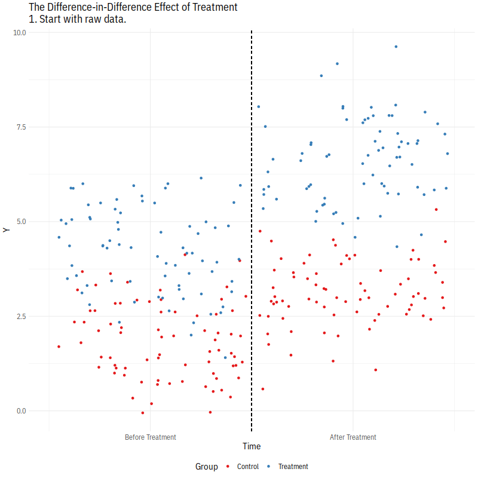

```{r setup, include=FALSE}
knitr::opts_chunk$set(message = FALSE, warning = FALSE, fig.align = 'center')
```
\newcommand{\y}{\mathbf{y}}
\newcommand{\X}{\mathbf{X}}
\newcommand{\E}{\mathbb{E}}
\newcommand{\V}{\mathbb{V}}
\newcommand{\independent}{\perp\!\!\!\perp}

I develop this document based on materials from the previous TAs for PS 200C, Doeun Kim and Soonhong Cho. 

## Difference-in-Differences

***

The key idea of DiD is comparing the changes over time (pre-treatment vs. post-treatment) in the treated group to the changes over time (pre-treatment vs. post-treatment) in the control group. **Hint**: this whole section relates to Pset 4, Q1.

```{r, echo=FALSE}
library(haven)
library(tidyverse)
library(estimatr)
library(knitr)
library(gridExtra)

tibble(Time = rep(c(1, 2), 3),
       Group = as.factor(rep(c(1, 2, 3), each=2)),
       y = c(0, .5, 1, 1.5, 1, 3.5)) %>% 
  ggplot(aes(x=Time, y=y, col=Group, linetype=Group)) +
  geom_point() +
  geom_line() +
  geom_vline(xintercept=1.5, linetype="dashed", col="gray") +
  scale_color_manual(values = c("1"="black", "2"="red", "3"="red"), 
                     labels = c("Control", 
                                "Counterfactual trajectory \n of treated in the \n absence of treatment",
                                "Treated")) +
  scale_linetype_manual(values = c("1"= "solid", "2"="dotted", "3"="solid"), 
                        labels = c("Control", 
                                "Counterfactual trajectory \n of treated in the \n absence of treatment",
                                "Treated")) +
  scale_x_discrete(limits = c("1", "2"), labels=c("1"="Pre-treatment", "2"="Post-treatment")) +
  labs(y="Expected Outcome") +
  theme_bw() +
  theme(axis.text.x = element_text(face="bold", size=12),
        legend.text=element_text(size=12),
        legend.spacing.y = unit(.5, 'cm')) +
  guides(color = guide_legend(byrow = TRUE))
```

### Assumptions and Identification Strategy

In a standard (2*2) setting, suppose we write the potential outcomes as $Y_{D}(T)$: 

|         |    Pre-Period (T=0)    |   Post-Period (T=1)   |
|---------|------------------------|-----------------------|
| Treated | $\E[Y_0(0)|D = 1]$ (A) | $\E[Y_1(1)|D = 1]$ (B)|
| Control | $\E[Y_0(0)|D = 0]$ (C) | $\E[Y_0(1)|D = 0]$ (D)|

 - Identification assumption: **parallel trends**, $\E[Y_0(1)-Y_0(0)|D = 0] = \E[Y_0(1)-Y_0(0)|D = 1]$.  
 - Estimand: ATT, which is $\E[Y_1(1)-Y_0(1)|D = 1]$. We can write it as: (B-A) - (D-C). 
 - What is missing? $\E[Y_0(1)|D = 1]$. Again, the fundamental problem of casual inference.

 $$
 \begin{aligned}
 \tau_{ATT} 
 &= \E[Y_1(1)|D = 1] - \E[Y_0(1)|D = 1] \\
 &= \{\E[Y_1(1)|D = 1] - \E[Y_0(0)|D = 1]\} - \{\E[Y_0(1)|D = 1] - \E[Y_0(0)|D = 1]\} \\
 &= \{\E[Y_1(1)|D = 1] - \E[Y_0(0)|D = 1]\} - \{\E[Y_0(1)|D = 0] - \E[Y_0(0)|D = 0]\} \\
 &= \{\E[Y(1)|D = 1] - \E[Y(0)|D = 1]\} - \{\E[Y(1)|D = 0] - \E[Y(0)|D = 0]\} 
 \end{aligned}
 $$

 - DiD estimator: $\E[Y_{itd}] = \beta_0 + \beta_1 \text{Treated}_d + \beta_2 \text{Post}_t + \beta_3 \text{Treated}_d*\text{Post}_t$. $\beta_3$ is the estimate, which is the interaction term in regression. We often set up two indicator variables, `post` = 1 if post-treatment period, `treat` = 1 if treated. Then we fit `lm_robust(Y ~ post*treat)`, and `post:treat` is the ATT estimate. 
 
|         |    Pre-Period (T=0)    |   Post-Period (T=1)   |    Difference   |
|---------|------------------------|-----------------------|-----------------------|
| Treated |  $\beta_0 + \beta_1$   | $\beta_0 + \beta_1 + \beta_2 + \beta_3$ | $\beta_2 + \beta_3$ |
| Control |  $\beta_0$             | $\beta_0 + \beta_2$   |  $\beta_2$   |

 - That is, $\beta_3$ is the difference in the differences ($\beta_2 + \beta_3$ and $\beta_2$).  
 - General advice: cluster SEs at least at the unit level. 
 
<br>

Here's an animation of how it works intuitively:
<br>

<p align="center">

</p>
(Credit: Apoorva Lal and Nick Huntington-Klein)

 <br>

### DiD Coding Example
***
 - **Malesky et al. 2014. The Impact of Recentralization on Public Services: A Difference-in-Differences Analysis of the Abolition of Elected Councils in Vietnam. APSR** ([2014](https://www.cambridge.org/core/journals/american-political-science-review/article/abs/impact-of-recentralization-on-public-services-a-differenceindifferences-analysis-of-the-abolition-of-elected-councils-in-vietnam/3477854BAAFE152DC93C594169D64F58))

 - Question: does (re)centralization improve local public service? How the abolition of local elected councils (= decentralization) affects local public services in Vietnam?
 
 - In Vietnam, District People's Councils (DPC) have been devices for decentralization: political, administrative and fiscal authorities of local governments were shifted to elected local councils. But, in 2009, Vietnamese political leaders piloted a removal of DPC in 99 districts across the country (so really a social quasi-experiment!)
 
 - The authors utilize the basic (2-periods) DiD design to study how the abolition of elected councils
affects local public services.

 - The DiD estimator with covariates (following Chad's notation) is: $$Y = \mu + \gamma D + \delta T + \tau (D \cdot  T) + X^T\beta + \epsilon,$$ where $D$ is the (eventually) treated units indicator (1 for communes that had their DPCs abolished, 0 otherwise), $T$ is post-treatment period indicator (1 for 2010, 0 for  2008; treatment strated in 2009), $X$ is (time-invariant) covariates, and $\tau$ is our quantity of interest.

```{r}
## data cleaning
data_06_08 <- read_dta("Malesky_et_al_2014/panel_commune_2006_2008.dta")
data_08_10 <- read_dta("Malesky_et_al_2014/panel_commune_2008_2010.dta")
data_2006 <- data_06_08 %>% filter(year == 2006)
data_2008 <- data_06_08 %>% filter(year == 2008)
data_2010 <- data_08_10 %>% filter(year == 2010)

# add district ID
data_2006$id_dist <- paste(data_2006$tinh, data_2006$huyen, sep = "d")
data_2008$id_dist <- paste(data_2008$tinh, data_2008$huyen, sep = "d")
data_2010$id_dist <- paste(data_2010$tinh, data_2010$huyen, sep = "d")

# merge
share <- intersect(colnames(data_2008), colnames(data_2010))
data_all <- bind_rows(
  data_2006 %>% dplyr::select(all_of(share)),
  data_2008 %>% dplyr::select(all_of(share)),
  data_2010 %>% dplyr::select(all_of(share))
)

# 30 outcome variables
# 1: "Infrastruture index", 2: "Agricultural Services index", 3: "Health Service index",
# 4: "Education index", 5: "Communication index", 6: "Household business development index"
index1 <- c("goodroadv", "transport", "pro3", "tapwater", "roadv")
index2 <- c("rm2c7d", "rm2c7e", "rm2c7g", "animal_s", "agrvisit", "plant_s", "agrext", "irrigation")
index3 <- c("rm2c7c", "pro5")
index4 <- c("pro4", "rm2c7b", "useschool", "kgarten", "v_prischool")
index5 <- c("broadcast", "post", "vpost")
index6 <- c("rm2c7a", "rm2c7f", "market", "nonfarm", "vmarket1", "vmarket2", "vmarket3")
outcomes <- c(index1, index2, index3, index4, index5, index6)

# make `city` variable (national-level cities - oversampled in treatment group)
data_all$city <- NA
for(i in 1:nrow(data_all)){
  if(data_all$year[i] <=2008){
    data_all$city[i] <- ifelse(data_all$tinh[i] ==101 | data_all$tinh[i]==103 | data_all$tinh[i]==501 |
                                 data_all$tinh[i]==815 | data_all$tinh[i]==701, 1, 0)
  }else if(data_all$year[i] > 2008){
    data_all$city[i] <- ifelse(data_all$tinh[i] ==1 | data_all$tinh[i]==31 | data_all$tinh[i]== 48 |
                                 data_all$tinh[i]== 92 | data_all$tinh[i]== 79, 1, 0)
  }
}
data_all$agrvisit <- data_all$agrvisit/100
data_all <- data_all %>% filter(reg8 != 6) # drop central highland

## subset data for saving
malesky2014 <- data_all %>%
  dplyr::select(all_of(outcomes), treatment, id_dist, 
                lnarea, lnpopden, city, reg8, rnongnghiep, rcongnghiep, rdichvu, year, tinh, huyen) %>%
  mutate(post_treat = ifelse(year == 2010, 1, 0)) ### this variable is "Time" variable in the paper ###
```

 <br>

#### Replicate main results (Table 2)
 - Variables:
    + `outcome variables` ($Y$): There are 30 outcome variables to measure local public services. For example, `transport` is a binary variable, the response to the question "Is there a passenger bus line, train or water transport that passes through the village?" `pro4` (Education and Cultural Program) is a binary variable, the response to the question "Is there the  following project in the commune?: Investment on culture and education"
    + `post_treat` ($T$): "Time" variable in the paper; 1 if 2010, 0 for 2008. Treatment was implemented in 2009.
    + `treatment` ($D$): Treatment variable, 1 for communes that had their DPCs abolished, and 0 otherwise.
    + `lnarea`: Area size of each commune.
    + `lnpopden`: Population of each commune.
    + `city`: Whether national-level city or not.
    + `reg8`: 8 regions, but one was excluded (Central Highlands) for security reasons. The models will contain regional fixed effects.
  
 - We include the interaction term of $T$ and $D$ to get the treatment effect on local public service outcomes over time.

 - They clustered SEs by district AND provinces; but let's cluster at the treatment level, i.e., district. (Perhaps we could compute SEs through block-bootstrap at the district level.)

```{r, message=FALSE, warning=FALSE}
# we only use 2008 and 2010 for analysis; 2006 data will be used to investigate parallel trends
data <- malesky2014 %>% filter(year != 2006)

# column1: All-Year Road in Commune as outcome
lm_robust(goodroadv ~ post_treat*treatment + lnarea + lnpopden + city + factor(reg8),
          data = data, clusters = id_dist) %>% tidy() %>% filter(term=="post_treat:treatment")

# column2: Commune Has Public Transport as outcome
lm_robust(transport ~ post_treat*treatment + lnarea + lnpopden + city + factor(reg8),
          data = data, clusters = id_dist) %>% tidy() %>% filter(term=="post_treat:treatment")

# Education and Cultural Program
lm_robust(pro4 ~ post_treat*treatment + lnarea + lnpopden + city + factor(reg8),
          data = data, clusters = id_dist) %>% tidy() %>% filter(term=="post_treat:treatment")
```

 - For example, all-year roads have grown about 8\% faster in the treatment than in the control group; Pubic transportation has grown 10\% faster; Education and cultural programs have grown 8\% faster. Re-centralization improved public service delivery at least in these areas.

 <br>

#### Visual Inspection of Parallel Trends Assumption
 - Since the validity of the DiD design rests on the parallel trend assumption, it is critical to evaluate its plausibility. It assumes that the change in $Y$ that would have happened in the treatment group in the absence of treatment is the same as the change in $Y$ in the control group. But the assumption is not empirically testable since it involves counterfactual outcomes.

 - One simple way to investigate it is to simply visualize "trends" using data for prior periods (2006 data in this case) as a placebo test.

```{r, message=FALSE, warning=FALSE}
malesky2014 <- malesky2014 %>% mutate(group=as.factor(ifelse(treatment==1, "Treat", "Control")))

# make a function for plot
trend_plot = function(data=data, outcome, ...) {
  group_mean <- data %>% group_by(year, treatment, group) %>% summarize(y = mean(!!outcome))
  ggplot(group_mean, aes(y=y, x=year, color=group)) +
    geom_point() +
    geom_line(aes(linetype=group)) +
    scale_linetype_manual(breaks=c("Control", "Treat"), values=c(5,1)) +
    geom_vline(xintercept=2009, linetype="dashed") +
    scale_x_continuous(breaks = sort(unique(data$year))) +
    #labs(title = outcome, x = "Year", y = "Group Mean of Outcome") +
    theme_bw()
}

# does outcome have parallel trends in pre-treatment periods (2006-2008)?
trend_plot(data=malesky2014, outcome = quo(goodroadv)) # All-Year Road: not at all
trend_plot(data=malesky2014, outcome = quo(pro4)) # Education and Cultural Program: seems parallel
```

 <br>
 <br>

## Synthetic Controls (Optional)

***
 - Motivation: say we have one unit treated and many control units. 
 
 - Synthetic control method: introduced by Abadie, Diamond, and Hainmueller (2010). The intuition is that we construct a hypothetical control by choosing a weighted average of the existing control units. The weights are computed so that the pre-treatment outcome of the "synthetic" control matches the pre-treatment outcomes and covaruates.

### Synthetic Controls Coding Example
 - We'll use `Synth` package. Jens Hainmueller has made a [short viedo](https://web.stanford.edu/~jhain/Video/SynthDemo.mp4) to introduce the synthetic control method. 
 
 - The empirical exampleis a dataset of Spanish regional economic development (Abadie and Gardeazabal [2003](https://www.aeaweb.org/articles?id=10.1257/000282803321455188)). 
 
 - Question: does violent conflict harm economic development?
 
 - Variables: 
     + Outcome ($Y$): GDP per capita.
     + Treatment ($D$): 1 (treated) if Basque Country which experienced political terrorism in the 1970s, 0 (control) other Spanish countries.
     + Treatment timing ($T$): 1 if in 1970-1997, 0 if in 1960-1969.
     
 - A simple pre-post comparisons are problematic because it is unclear what other shocks might produce a change in trend; a diff-in-diff might seem appealing but it would be difficult to claim parallel trends and the control pool is too small to draw from.
 

```{r}
library(Synth)
data(basque) # loading a dataset included in package
basque %>% count(regionname) %>% head()
```

Each row is an observation-year and we have 43 years for each country, so "balanced" panel data.

```{r}
unique(basque[, 1:2])
```

What is the treated group? 17 is Basque Country (Pais Vasco).

```{r}
# First Synth step: Tell Synth to cut up your data
prepared_data <- dataprep(
  basque,
  unit.variable = "regionno",
  time.variable = "year",
  predictors = "gdpcap", # which predictors (covariates) we are going to weight on
  dependent = "gdpcap", # outcome variable
  treatment.identifier = 17, # treatment group is Region #17
  time.predictors.prior = 1960:1969,
  time.optimize.ssr = 1960:1969,
  time.plot = 1955:1997, # what years to plot in a subsequent plot
  controls.identifier = c(2:16, 18) #control group (Region 1 is national data for all of Spain)
)
unique(basque$regionname)
model_1 <- synth(data.prep.obj = prepared_data, optimxmethod = "BFGS")
```

"BFGS" is just a optimization algorithm (Broyden–Fletcher–Goldfarb–Shanno), which you'll see in MLE course again. We can see the weights given to the controls! So our control unit would be $$1.4\% \text{ Andalucia} + \cdots +3.8 \% \text{ Cataluna} + \cdots + 68.7\% \text{ Madrid} + \cdots.$$

We can plot the trajectories of treated and control groups, matching on pre-treatment outcomes.

```{r}
plot_data <- tibble(control = (prepared_data$Y0plot %*% model_1$solution.w), #weighted combination
                    treated = prepared_data$Y1plot,
                    years = c(1955:1997))
ggplot(plot_data, aes(x=years, y = treated)) +
  geom_line(aes(linetype ="Basque (Treated)")) +
  geom_line(aes(x= years, y=control, linetype ="Synthetic Control")) + 
  geom_vline(aes(xintercept = 1970, color = "Treatment Begins")) + 
  theme_bw() +
  labs(x="Year", y="GDP per capita") +
  theme(legend.title = element_blank(), legend.position = "bottom")
```

Or, we can plot just the divergence of them.

```{r}
plot_data$diff <- plot_data$treated - plot_data$control
ggplot(plot_data, aes(x=years, y = diff)) +
  geom_line(aes(linetype = "Diff: Treat- Synth Control")) + 
  geom_hline(yintercept= 0, linetype = 2) +
  geom_vline(aes(xintercept = 1970, color = "Begin Treatment")) + 
  theme_bw() +
  labs(x="Year", y="GDP per capita") +
  ggtitle("Difference in Treated and Synth Control Trend") + 
  theme(legend.title = element_blank(), legend.position = "bottom")
```

Here we see the gap is a little more severe; within a few years of the beginning of hostilities, the Basque Country region has fallen half a log-income unit behind the synthetic control. We can get numerical differences as well.

```{r}
# Create numerical gaps between treated and synthetic control
gaps <- prepared_data$Y1plot - (prepared_data$Y0plot %*% model_1$solution.w)

# Subset to just the years after treatment
minimum_number = (1970 - 1955) + 1
gaps[minimum_number:length(gaps), ]
```

Let's do a placebo test: apply the same technique to Catalonia, a region similar to the Basque Country but with a much lower exposure to terrorism. Can we find similar treatment effects?

```{r}
placebo_data <- dataprep(
  basque,
  unit.variable = "regionno",
  time.variable = "year",
  predictors = "gdpcap", # which predictors (covariates) we are going to weight on
  dependent = "gdpcap", # outcome variable
  treatment.identifier = 10, # suppose treatment group is Region #10 (Cataluna)
  time.predictors.prior = 1960:1969,
  time.optimize.ssr = 1960:1969,
  time.plot = 1955:1997, # what years to plot in a subsequent plot
  controls.identifier = c(2:9, 11:18) # control group (Region 1 is national data for all of Spain)
)

model_placebo <- synth(data.prep.obj = placebo_data, method = "BFGS")
plot_data3 <- tibble(treated = placebo_data$Y1plot,
                     control = (placebo_data$Y0plot %*% model_placebo$solution.w), #weighted combination
                     years = c(1955:1997))
ggplot(plot_data3, aes(x=years, y = treated)) +
  geom_line(aes(linetype ="Cataluna (Placebo)")) +
  geom_line(aes(x= years, y=control, linetype ="Synthetic Control")) + 
  geom_vline(aes(xintercept = 1970, color = "Treatment Begins")) + 
  theme_bw() +
  labs(x="Year", y="GDP per capita") +
  theme(legend.title = element_blank(), legend.position = "bottom")
```

So far, we used only outcome variable. As the dataset contains a bunch of observed confounders, so let's use them.

```{r}
full_prep_data <- dataprep(
  basque, # dataset
  predictors = c("school.illit", "school.prim", "school.med", 
                 "school.high", "school.post.high", "invest"), # covariates available for whole period
  time.predictors.prior = 1964:1969,
  special.predictors = list( # covariates whose time availability differs
    list("gdpcap", 1960:1969, "mean"),
    list("sec.agriculture", seq(1961, 1969, 2), "mean"),
    list("sec.energy", seq(1961, 1969, 2), "mean"),
    list("sec.industry", seq(1961, 1969, 2), "mean"),
    list("sec.construction", seq(1961, 1969, 2), "mean"),
    list("sec.services.venta", seq(1961, 1969, 2), "mean"),
    list("sec.services.nonventa", seq(1961, 1969, 2), "mean"),
    list("popdens", 1969, "mean")
  ),
  dependent = "gdpcap",
  unit.variable = "regionno",
  time.variable = "year",
  treatment.identifier = 17,
  controls.identifier = c(2:16, 18),
  time.optimize.ssr = 1960:1969,
  time.plot = 1955:1997
)

# run model
model_2 <- synth(data.prep.obj = full_prep_data, method = "BFGS")

# plot
plot_data2 <- tibble(treated = full_prep_data$Y1plot,
                     control = (full_prep_data$Y0plot %*% model_2$solution.w), # weighted combination
                     years = c(1955:1997))
ggplot(plot_data2, aes(x=years, y = treated)) +
  geom_line(aes(linetype ="Basque (Treated)")) +
  geom_line(aes(x= years, y=control, linetype ="Synthetic Control")) + 
  geom_vline(aes(xintercept = 1970, color = "Treatment Begins")) + 
  theme_bw() +
  labs(x="Year", y="GDP per capita") +
  theme(legend.title = element_blank(), legend.position = "bottom")
```

Here, we see an even more pronounced effect on a model that we think might be better identified: because it allows for more pre-treatment information (from covariates) to construct the synthetic controls, which can be seen in the better trajectory balance between treated and synthetic control. We've learned that a long running regional civil war is bad for economic development.

