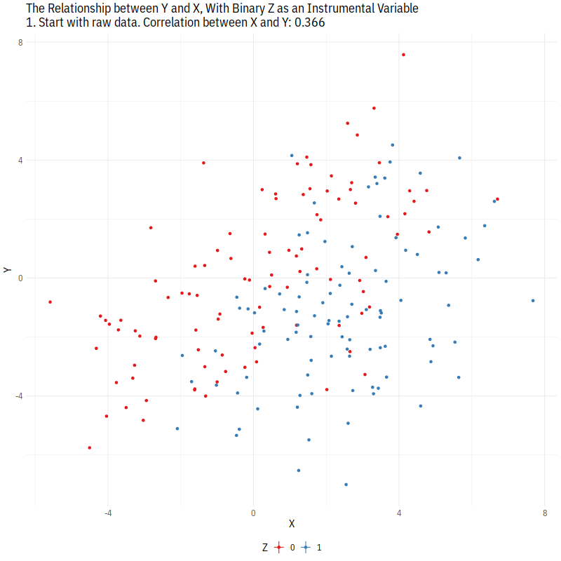
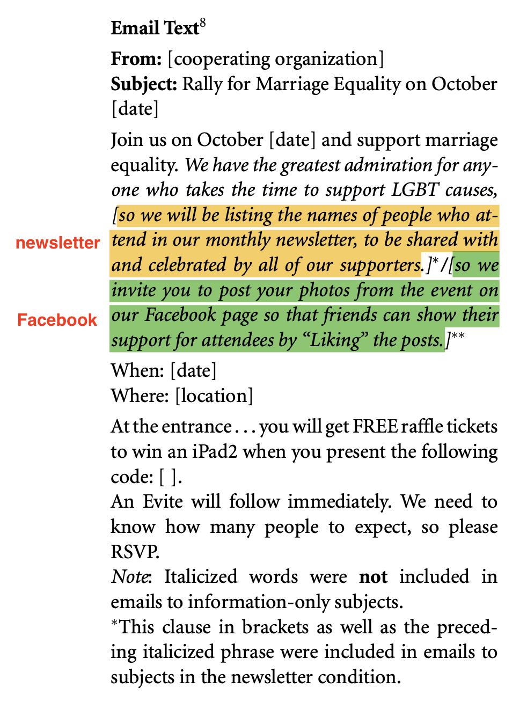
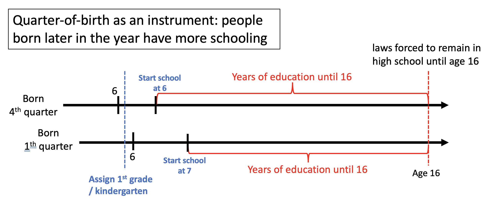

```{r setup, include=FALSE}
knitr::opts_chunk$set(message = FALSE, warning = FALSE, fig.align = 'center')
```

\newcommand{\y}{\mathbf{y}}
\newcommand{\X}{\mathbf{X}}
\newcommand{\Z}{\mathbf{Z}}
\newcommand{\E}{\mathbb{E}}
\newcommand{\V}{\mathbb{V}}
\newcommand{\independent}{\perp\!\!\!\perp}


## Instrumental Variables

### Potential outcomes for Instrumental Variable - Encouragement design
***
 - **<span style="color:red;">Encouragement design</span>**: when *treatment* itself cannot be randomized (for ethical or logistical reasons), *encouragement* to receive treatment is randomized instead.
 
 - **<span style="color:red;">Intention-to-Treat (ITT)</span>** effect: a simple comparison of randomized groups (encouraged vs. not encouraged) produces an estimate of the effect of encouragement, not an estimate of the treatment effect itself.
 
 - We still can take advantage of the randomization to estimate a causal effect, for at least some of the people (compliers) by using the **encouragement as an "instrument"**.

 - Potential outcomes model:
     + Randomized encouragement: $Z_i \in \{0, 1\}$
     + Potential treatment variables: $$D_{zi} = \begin{cases} 1 \text{ if unit } i \text{ would receive the treatment if } Z_i=z \\ 0 \text{ if unit } i \text{ would not receive the treatment if } Z_i=z \end{cases}$$
     + Observed and potential outcomes: $Y_i = Y_i(Z_i, D_{zi})$
     + Randomization of encouragement: $$\{Y_{1i}, Y_{0i}, D_{1i}, D_{0i}\} \independent Z_i$$
     + But randomized encouragement does not ensure conditional ignorability, i.e., $\{ Y_{1i}, Y_{0i} \} \not\!\perp\!\!\!\perp D_i|Z_i=z$: **those who take the treatment if encouraged might not be the same as those who do not!**
 
 <br>
 
 - "Principal stratification" framework:
     + Four latent types based on reaction-to-encouragement
         1. **<span style="color:red;">Compliers</span>**: $(D_{1i}, D_{0i}) = (1,0)$, people would take treatment if encouraged / would not take it if not encouraged (responsive to encouragement)
         
         2. Non-compliers: 
             + Always-takers ($(D_{1i}, D_{0i}) = (1,1)$)
             + Never-takers ($(D_{1i}, D_{0i}) = (0,0)$)
             + Defiers ($(D_{1i}, D_{0i}) = (0,1)$)
 
 <br>
 
 - Assumptions (1, 2 guaranteed in encouragement design):
     1. Randomized encouragement
     2. Relevance: encouragement induces variability in treatment receipt ($Z$ affects $D$)
     3. Exclusion restriction: encouragement affects outcome only through treatment $$Y_i(Z_i=1, D_{zi}=d) = Y_i(Z_i=0, D_{zi}=d) \quad \text{ for } d=0, 1,$$ or, zero ITT effect for Always-takers and Never-takers!
     4. Monotonicity: no Difiers ($D_{1i} \geq D_{0i}  \text{ for all }i$)

 <br>
 
 - ITT effect can be decomposed as a weighted average of subgroup effects:
 \begin{align*}
 \text{ITT} &= \text{ITT}_C \times \Pr(\text{Compliers}) + \overbrace{\text{ITT}_{AT}}^{\substack{=0 \text{ by } \\ \text{Exclusion} \\ \text{Restriction}}} \times \Pr(\text{Always-Takers}) + \\ &\qquad \underbrace{\text{ITT}_{NT}}_{\substack{=0 \text{ by } \\ \text{Exclusion} \\ \text{Restriction}}} \times \Pr(\text{Never-Takers}) + \text{ITT}_{D} \times \underbrace{\Pr(\text{Defiers}}_{\substack{=0 \text{ by}} \\ \text{Monotonicity}}) \\
 &=\text{ITT}_C \times \Pr(\text{Compliers})
 \end{align*}
 
 <br>
 
 - IV estimand is:
 \begin{align*}
 \text{ITT}_C &= \E[Y_{1i}-Y_{0i} \mid D_{1i}>D_{0i}]\\
 &=\frac{\text{ITT}}{\Pr(\text{Compliers})} \\
 &= \frac{\E[Y_i \mid Z_i=1] - \E[Y_i \mid Z_i=0]}{\E[D_i \mid Z_i=1] - \E[D_i \mid Z_i=0]} &(\text{each result in Pset})\\
 &= \frac{\text{Cov}(Y_i, Z_i) / Var(Z_i)}{\text{Cov}(D_i, Z_i)/Var(Z_i)}
 \end{align*}

 - $\text{ITT}_C$ is called **<span style="color:red;">Complier Average Treatment Effect</span>**, a case of Local Average Treatment Effect (LATE)
 
 - Estimation:
     1. Wald estimator: $\widehat{IV}_{Wald} = \frac{\widehat{\text{Cov}(Y_i, Z_i)}}{\widehat{\text{Cov}(D_i, Z_i)}} = \frac{\widehat{\text{ITT}}_Y}{\widehat{\text{ITT}}_D},$ so the reduced form divided by the first stage effect.
     
     2. 2-Stage Least Squares estimator: $\widehat{IV}_{2SLS} = \frac{\widehat{\text{Cov}(Y_i, Z_i) / Var(Z_i)}}{\widehat{\text{Cov}(D_i, Z_i)/Var(Z_i)}} = \frac{(Z'Z)^{-1}(Z'Y)}{(Z'Z)^{-1}(Z'D)} = (Z'D)^{-1}(Z'Y)$ 

 <br>

How it works:

```{r, echo=FALSE, out.width='70%'}

```
(Credit: Apoorva Lal and Nick Huntington-Klein)

 <br>

#### Encouragement experiment example
***
 - **McClendon, G. 2014. Social esteem and participation in contentious politics: A field experiment at an lgbt pride rally. AJPS** ([2014](https://onlinelibrary.wiley.com/doi/abs/10.1111/ajps.12076))

 - Question: can social esteem from an ingroup motivate people to participate in contentious politics?
 
 - Randomized encouragement to participate in LGBTQ events (to click "display images below" within the email messages)

 - Treatment: Reading social esteem promising email.
      1. control group "information-only condition": "Join us on October [date] and support marriage equality. We have the greatest admiration for anyone who takes the time to support LGBT causes,"
      2. treatment 1 group **"newsletter condition"**: "so **we will be listing the names of people who attend in our monthly newsletter**, to be shared with and celebrated by all of our supporters."
      3. treatment 2 group **"facebook condition"**: "so **we invite you to post your photos from the event on our Facebook page** so that friends can show their support for attendees by “Liking” the posts."
  
      
<p align="center">
  
</p>      
  
  
 - Outcome: Participation in LGBTQ events. (1) Intended participation (binary, 1 if "yes" to RSVP), (2) Actual participation (binary, 1 if subject picked up a raffle ticket at the entrance of the event with individual code included in email), and (3) online survey
 

```{r, fig.align='center'}
library(haven)
library(tidyverse)
library(estimatr)
library(knitr)

## Data
mcclendon <- read_dta("lgbtrally_anondata.dta")
mcclendon <- mcclendon %>% filter(!is.na(esteem)) #delete NAs in encouragement

#how many of each treatment arms are there? 
mcclendon %>% group_by(newsletter, facebook) %>% count
```

First, ITT effect (effect of assignment to email messages) estimates.

```{r}
#Y: `intended` and `attended`, D: `openedesteem`, Z: `newsletter` or `facebook` or `esteem`

#### Table 1: ITT estimates (naive difference-in-means estimates)
#column 1: Intent to participate as outcome
#effect of newsletter treatment / facebook treatment / pooled result
difference_in_means(intended ~ newsletter, data=mcclendon %>% filter(newsletter==1 | control==1))
difference_in_means(intended ~ facebook, data=mcclendon %>% filter(facebook==1 | control==1))
difference_in_means(intended ~ esteem, data=mcclendon)

#column 2: Actual participation as outcome
difference_in_means(attended ~ newsletter, data=mcclendon %>% filter(newsletter==1 | control==1))
difference_in_means(attended ~ facebook, data=mcclendon %>% filter(facebook==1 | control==1))
difference_in_means(attended ~ esteem, data=mcclendon)
```

Simply being assigned to newsletter or Facebook (or one of them) email, regardless of whether one actually opened and read it, produced about a 2.5\%p increase in intended participation and a 1.3\%p increase in actual participation. Considering the base actual participation in control group is only 1.72\% the effect is quite large. Also, including some covariates has little effect.

```{r}
#how large?: base actual participation in control group is only 1.72%
mcclendon %>% filter(control==1) %>% summarize(mean(attended, na.rm=TRUE))

## with regression adjustments (Table 7 in online appendix)
lm_robust(intended ~ newsletter + facebook + female + fivemiles + fouryears, data=mcclendon)
lm_robust(attended ~ newsletter + facebook + female + fivemiles + fouryears, data=mcclendon)
```

What about Complier Average Treatment Effect? Complier ATE is the effect for those who would read the treatment email if and only if they are contacted by email. We can use `ivreg` function in the `AER` package to obtain 2SLS estimate.

```{r}
#proportion of compliers
mcclendon %>% summarize(compliers = mean(openedesteem[esteem==1]) - mean(openedesteem[esteem==0]))
#F-statistic of first-stage (D ~ Z)
summary(lm(openedesteem ~ esteem, mcclendon))$fstatistic[1]
#assignment to the newsletter/Facebook treatments seems not a weak instrument

#### Table 2: IV estimates (Complier ATE)
#getting estimate by hand
first <- summary(lm(openedesteem ~ esteem, mcclendon))$coefficient[2, ]
reduced <- summary(lm(attended ~ esteem, mcclendon))$coefficient[2, ]
reduced[1]/first[1] #Complier ATE

#using package
iv_robust(intended ~ openedesteem | esteem, data = mcclendon)
iv_robust(attended ~ openedesteem | esteem, data = mcclendon)
```

What is the effect of closely reading an esteem treatment email (either newsletter or Facebook) on participation? On actual participation it's more than 12 times greater than ITT effect (1.3\%p to 16.3\%p), since we divided ITT by the proportion of compliers (7.9\%). Don't forget that we interpret it as a Local ATE, that is, just for compliers (it might be that compliers are different from population in many ways).

 <br>
 <br>


### A seminal paper in IV approach
***
 - In observational setting, we try to find instruments in the nature, or "natural experiments," where the instrument $Z$ is randomized and has no direct effect on the outcome $Y$ (indirect effect only through the treatment $D$).
 
 - **Angrist, Joshua and Alan Krueger 1991. "Does Compulsory School Attendance Affect Schooling and Earnings? The Quarterly Journal of Economics 106(4)** ([1991](https://academic.oup.com/qje/article-abstract/106/4/979/1873496))
 
 - Question: What is the causal effect of education on earnings?
 
 - Potential unobserved confounders? Ability (workers with high innate ability are assumed to find school less difficult and to obtain more schooling to signal their high ability, and also earn more). Without measured ability, we can't expect that conditional ignorability, or SOO, holds.
 
 - Since innate ability, an obvious confounder, is not measurable (how can we even define one's ability?), adjusting for observed covariates through regression, subclassification, or matching/weighting would not be sufficient to obtain valid causal estimates.
 
 - Thus, the **<span style="color:red;">quarter of birth</span>** is introduced as the instrument for educational attainment to address this "ability bias." It is random and seems to have no direct effect on earning.
 
 - Two arbitrary cutoffs provides "natural experiment":
     1. Arbitrary assignment of school start: at a certain administrative cutoff (typically late Dec), a child is assigned for either the 1st grade or kindergarten based on when their birthday is.
     
     2. Compulsory education law in US: students must attend school until they reach age 16. Thus the law keeps students enrolled longer than they might want (they could legally drop out after 16). Individuals born in the beginning of the year start school at an older age, and can therefore drop out after completing less schooling than individuals born near the end of the year.
 
<p align="center">
  
</p>  
 
 <br>
 
 - "This paper exploits an unusual natural experiment to estimate the impact of compulsory schooling laws in the Unites States. The experiment stems from the fact that children born in different months of the year start school at different ages, while compulsory schooling laws generally require students to remain in shcool until their sixteenth or seventeenth birthday. In effect, the interaction of school-entry requirements and compulsory schooling laws compel students born in certain months to attend school longer than students born in other months. Because one's birthday is unlikely to be correlated with personal attributes other than age at school entry, season of birth generates exogenous variation in education that can be used to estimate the impact of compulsory schooling on education and earnings (pp.979-80)"
 
 - Instrument ($Z$) is Quarter of birth, Treatment ($D$) is Receiving additional education, and Outcome ($Y$) is Earnings.
 
 <br>
 
#### Assumptions
 1. Exogeneity of the instrument (exogeneity of the instrument)
     + Is the quarter of birth "random"?
     
 2. Exclusion restriction (NOT A TESTABLE ASSUMPTION)
     + Does birth quarter affect earnings through some channels other than education? (random assignment of the instrument is not sufficient)
 
 3. Relevance (first-stage relationship)
     + Does birth quarter induce variation in years of schooling? Is the relationship strong enough?
     
 4. Monotonicity
     + Are there defiers (against compulsory schooling laws)?

 <br>

 - Instrument Relevance (visual inspection): we can see a clear pattern, 3rd and 4th quarter born men have more schooling than 1st and 2nd quarter births, on average.

```{r}
qob_data <- read.table("asciiqob.txt", header=FALSE, stringsAsFactors = FALSE)
colnames(qob_data) <- c("lwklywge", "educ", "yob", "qob", "ageq")

qob_data <- qob_data %>%
  mutate(cohort = case_when(yob %in% 30:39~ 3039,
                            yob %in% 40:49~ 4049,
                            TRUE ~ 20.29),
         month = case_when(
           qob == 1 ~ "01",
           qob == 2 ~ "04",
           qob == 3 ~ "07",
           qob == 4 ~ "10"),
         ageq = ageq - 1900,
         ageq_sq = ageq^2)  %>% 
  filter(cohort == 3039)  %>%  #use only cohort of those born in 1930s
  mutate(yqob = paste0(19, yob, "-", month, "-", 01) %>% as.Date()) %>% 
  select(-month)

qob_means <- qob_data %>% group_by(yob, qob, yqob) %>% summarise_all(list(mean))

## Figure 1
ggplot(qob_means, aes(x=yqob, y=educ)) +
  geom_line() +
  geom_point(aes(color = factor(qob)), size = 4, shape=15) +
  geom_text(aes(label = qob, color = "white"), 
            size  = 2, hjust = 0.5, vjust = 0.5, show_guide = FALSE) +
  scale_colour_manual(values = c("blue", rep("black", 3), "white"), 
                      guide = FALSE) +
  labs(title="First-stage: Average education by quarter of birth",
       x="Year of Birth", y="Years of Completed Education") +
  theme_bw()
```

 <br>

#### Analyses
 - Reduced form: Do 1st quarter men have lower earnings? Differences in schooling years due to quarter of birth seem to produce different earnings.
 
```{r}
#Figure 5 (only for 1930-39 cohort here)
ggplot(qob_means, aes(x=yqob, y=lwklywge)) +
  geom_line() +
  geom_point(aes(color = factor(qob)), size = 4, shape=15) +
  geom_text(aes(label = qob, color = "white"), 
            size  = 2, hjust = 0.5, vjust = 0.5, show_guide = FALSE) +
  scale_colour_manual(values = c("blue", rep("black", 3), "white"), guide = FALSE) +
  labs(title="Reduced form: Average weekly wage by quarter of birth",
       x="Year of Birth", y="Log Weekly Earnings") +
  theme_bw()
```

 - Again, we can use `ivreg` to get 2SLS estimate. Also, `iv_robust` gives easy robust standard errors.
     
```{r}
#OLS estimate
ols_res <- lm(lwklywge ~ educ + ageq + ageq_sq + factor(yob), data = qob_data)
round(summary(ols_res)$coefficients["educ",], 4)

#IV estimate (with some covariates for code illustration)
library(AER) #for `ivreg` function
sort(unique(qob_data$yqob)) #our IV is year-quarter (each being a dummy variable for regression)
iv_res <- ivreg(lwklywge ~ educ + ageq + ageq_sq + factor(yob) | #second-stage (treatment: `educ`)
                  factor(yqob) + ageq + ageq_sq + factor(yob), #first-stage (IV: `factor(YOBQ)`)
                data = qob_data)
round(summary(iv_res)$coefficients["educ",], 4)

#using iv_robust in `estimatr` package to easily get robust SEs
iv_estimatr <- iv_robust(lwklywge ~ educ + ageq + ageq_sq + factor(yob) | #second-stagee
                           factor(yqob) + ageq + ageq_sq + factor(yob), #first-stage
                         data = qob_data, se_type="HC2")
round(summary(iv_estimatr)$coefficients["educ",], 4) #slightly larger SE
```

  - OLS and IV (2SLS) estimates (Table 5, columns 3 and 4): one more year of education is associated with an additional 7\% in weekly wages with OLS, but with 2SLS with IV it’s higher (7.6\%).

### Acknowledgement
I develop this document referencing to materials from Soonhong Cho, the previous TA for PS 200C.
