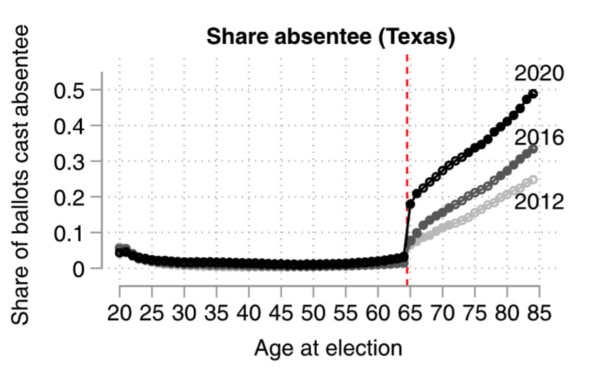

```{r setup, include=FALSE}
knitr::opts_chunk$set(message = FALSE, warning = FALSE, fig.align = 'center')
```
\newcommand{\y}{\mathbf{y}}
\newcommand{\X}{\mathbf{X}}
\newcommand{\Z}{\mathbf{Z}}
\newcommand{\E}{\mathbb{E}}
\newcommand{\V}{\mathbb{V}}
\newcommand{\independent}{\perp\!\!\!\perp}

I develop this document based on materials from the previous TAs for PS 200C, Doeun Kim and Soonhong Cho. 

## Regression Discontinuity Design
***

 - Sharp RDD: find a fixed cutoff point $c$ of a running (forcing) variable $X$ which determines the treatment assignment such that $D_i = \mathbf{1}_{\{X_i \geq c\}}$. If $D_i$ is only probabilistically (not completely) determined, it's called "fuzzy" RDD.
 
 - Example 1: close elections as RD design
     + Running variable ($X_i$) is the Democratic vote margin for district $i$.
     + Treatment ($D_i$) is winning the current election at $t$, so vote margin $c = 0$ (e.g., being an "incumbent" party/candidate for the next election at $t+1$).
     + Outcome ($Y_i$). For example, if we're interested in incumbency effect, then outcome is winning probability or vote share in the next election at $t+1$.
     + The "discontinuity" at the cutoff point is our estimate.

 - Example 2: How Did Absentee Voting Affect the 2020 U.S. Election? Yoder et al. (2021) 
     + Setting: 65-year-olds can vote-by-mail without an excuse, while 64-year-olds must provide an excuse to vote absentee.
     + $Y_{iat} = \beta_t (\text{Age}=65)_{iat} + \delta_t + \epsilon_{iat}$, where $\beta_t$ is the gap between 65- and 64-year-olds, and $\delta_t$ is election fixed effects. 
 
<p align="center">
  
</p>  

 <br>
 
### Identification

 - Estimand: $\E[Y_{1i} - Y_{0i} \mid X_i=c]$
 
 - Assumption: $\E[Y_{1i} \mid X_i=x]$ and $\E[Y_{0i} \mid X_i=x]$ are **<span style="color:red;">continuous</span>** in $X_i$ around the threshold $c$. It requires that the only change occurring at the cutoff is the shift in the treatment status (control to treated).
     + E.g., $Y_{1i}$: the Democratic vote share in the next election $t+1$, if a Democratic (Republican) candidate won the election in the current period $t$, $D_i=1$ ($D_i=0$). Democratic victory is treatment, GOP winning is control.
     
     + The continuity assumption can be written as $$\E[Y_{1i} \mid X_i=c] = \lim_{x \downarrow c} \E[Y_{1i} \mid X_i=x]$$ and $$\E[Y_{0i} \mid X_i=c] = \lim_{x \uparrow c} \E[Y_{0i} \mid X_i=x],$$ where the limit is taken from above/below the threshold $c$. It can also be written that the potential outcomes are the same for $c - \epsilon < X_i < c+\epsilon$ as $\epsilon$ goes to 0.
     
     + It implies that there is no **discontinuous jump** in the conditional expectation function of each potential outcome. Or, we're assuming that the conditional expectation of potential outcomes at $c$ can be approximated well from one side rather than from both sides.
     
     + This "*Continuity-Based* Approach" to RD design is different from *local randomization* framework for RD design: briefly, local randomization assumption near the threshold is more strict than the required continuity assumption. Within the window, the average potential outcomes must be **identical** below and above the threshold under local randomization, whereas continuity assumption does not require it (de la Cuesta and Imai [2016](https://www.annualreviews.org/doi/10.1146/annurev-polisci-032015-010115)).
     
 
 - ATE at $c$ can be identified under the continuity assumption:
 \begin{align*}
 \E[Y_{1i} - Y_{0i} \mid X_i=c] &= \lim_{x \downarrow c} \E[Y_{1i} \mid X_i=x] - \lim_{x \uparrow c} \E[Y_{0i} \mid X_i=x] \\
 &= \underbrace{\lim_{x \downarrow c} \E[Y_{i} \mid X_i=x]}_{\text{average just above }c} - \underbrace{\lim_{x \uparrow c} \E[Y_{i} \mid X_i=x]}_{\text{average just below }c}
 \end{align*}

 <br>

Here's an animation of how it works intuitively:
<p align="center">

</p>
(Credit: Apoorva Lal and Nick Huntington-Klein)

### Analysis methods under the RD Design
 - The problem is how to estimate the conditional expectation $\E[Y \mid X]$ on each side
     1. Difference-in-Means estimator from each side, within a small window around $c$
     
     2. Simple linear regression within a small window
     
         + Problems: how to choose the best window / how to choose the functional form
     
     3. Local linear/polynomial regression (same window/bandwidth for both sides)
     
         + More flexible (lower bias) but might have greater variability (higher variance)

 <br>
 
 - Intuition for "local" models (Kernel estimation)
     + We calculate (weighted) moving averages to estimate $\E[Y \mid X]$, with weighting (in certain way) each unit at each value of $X=x$.
     
     + We're thinking of weighted means like $\widehat{\E[Y \mid X]} = \sum_{i=1}^n W_i(x) y_i$ subject to $\sum_{i} W_i(x)=1$. We typically use "kernel" function for weighting as $W_i(x) = \frac{K\left( \frac{x-x_i}{h} \right)}{\sum_{i=1}^n K\left( \frac{x-x_i}{h} \right)}$, with $h$ is called "bandwidth"
     
     + Kernel function determines weighting scheme.
         1. Uniform kernel: each unit is given equal weight
         2. Triangular kernel: farther units are given smaller weights, using linear distance
         3. Gaussian kernel: farther units are given less weight, according to normal density function
         
     + We apply this idea to regression setting: $$(\hat{\alpha}_{+}, \hat{\beta}_{+}) = \underset{\alpha, \beta}{\text{argmin}} \sum_{i=1}^n \mathbf{1}\{ X_i > c\}\{Y_i - \alpha - (X_i-c)\beta\}^2 \cdot K \left( \frac{X_i-c}{h} \right),$$ and $$(\hat{\alpha}_{-}, \hat{\beta}_{-}) = \underset{\alpha, \beta}{\text{argmin}} \sum_{i=1}^n \mathbf{1}\{ X_i < c\}\{Y_i - \alpha - (X_i-c)\beta\}^2 \cdot K \left( \frac{X_i-c}{h} \right),$$ then $\hat{\tau}^{RD} = \hat{\alpha}_{+} - \hat{\alpha}_{-}.$


 <br>
 

### RDD Coding Example
 
- Incumbent-party advantage: what is the effect of the Democratic party winning a Senate seat on its vote share in the following election for that seat? See Cattaneo,Frandsen, and Titiunik ([2015](https://cattaneo.princeton.edu/papers/Cattaneo-Frandsen-Titiunik_2015_JCI.pdf)) for details.


```{r}
library(haven)
library(tidyverse)
library(rdrobust) # RDD package
library(estimatr)
library(stargazer)
library(knitr)

#incumbent advantage in US Senate election
data_rd <- read_dta("senate.dta")
data_rd <- as_tibble(data_rd) %>%
  #forcing (running) variable: `margin` / outcome variable: 'vote' -- vote share
  mutate(margin = demmv, vote = demvoteshfor2) %>% 
  #treatment (`incumbent`) as a deterministic function of running variable ("Sharp RDD")
  mutate(incumbent = margin>=0) #cutoff is when margin=0, i.e., X_i=c=0

#Sharp RDD
#Pr(D=1) changes exactly from zero to one at the cutoff!
ggplot(data_rd, aes(x=margin, y=incumbent, color=as.factor(incumbent))) +
  geom_point(alpha = 0.5, size = 0.3) +
  labs(title = 'Incumbency as a function of past vote margin', 
       y="Prob of Receiving Treatment (Incumbency)", x="Vote Margin") + 
  theme_bw()
```

#### Quick visual inspection
```{r}
#raw comparison of means
rdplot(data_rd$vote, data_rd$margin,
       c = 0, #c: cutoff (default is 0)
       p = 0, #p: order of polynomial, so 0 is for mean
       nbins = c(2500, 500), #number of bins: usually you don't have to specify it
       col.lines = "red", col.dots = "gray", 
       x.label = "Past Election Margin", y.label = "Current Vote share", title = "", y.lim = c(0,100))

#local comparison of means
rdplot(data_rd$vote[abs(data_rd$margin) <= 10], data_rd$margin[abs(data_rd$margin) <= 10],
       c = 0, 
       p = 2, #polynomial of order 2 (quadratic)
       nbins = c(2500, 500), 
       col.lines = "red", col.dots = "gray", 
       x.label = "Past Election Margin", y.label = "Current Vote share", title = "", y.lim = c(0,100))
```


#### Point Estimation
Let's start with a simple regression framework with same slope / different slope models.

```{r}
## Estimating treatment effects
# 1. 
#simplest: linear, same slope
lm(vote ~ incumbent + margin, data=data_rd)

#linear, but different slope: use interaction term!
lm(vote ~ incumbent*margin, data=data_rd)

#with second-order terms (w/ another syntax)
lm(vote ~ incumbent + margin + I(margin^2) + incumbent:margin + incumbent:I(margin^2), data=data_rd)
```

Next, let's turn to "local" estimation. That is, we're choosing a small window around the threshold $c$, then do the same analyses in the chosen window (technically, it's the same as the local linear RD estimate with a uniform kernel). I chose an arbitrary bandwidth of 10.

```{r}
#(local) linear regression
summary(lm(vote ~ incumbent + margin, data=data_rd %>% filter(abs(margin) < 10)))$coefficients
summary(lm(vote ~ incumbent*margin, data=data_rd %>% filter(abs(margin) < 10)))$coefficients

#(local) polynomial fit
summary(lm(vote ~ incumbent + margin + I(margin^2) + incumbent:margin + incumbent:I(margin^2), 
           data=data_rd %>% filter(abs(margin) < 10)))$coefficients
```

How about a local linear regression with a triangular kernel instead of a uniform kernel? Recall that using kernel means that it gives each unit different weights based on their distance from the center of the kernel (in RD setting, the cutoff point $c$). The triangular kernel weights units according to the linear distance, from center to the ends of our chosen window (i.e., 0 to -10 and 0 to 10).

To help your understanding, we'll manually compute the weights according to the triangular kernel formula and use those weights in the regression function.

```{r}
#generating triangular weights
w <- ifelse(abs(data_rd$margin) > 10, 0, NA) #put zero weight for units outside of our window
left_local <- data_rd$margin < 0 & data_rd$margin >= -10 #below c (left) in our window
right_local <- data_rd$margin >= 0 & data_rd$margin <= 10 #above c (right) in our window
w[left_local] <- 1 - abs(data_rd$margin[left_local] / 10) 
w[right_local] <- 1 - abs(data_rd$margin[right_local] / 10) 

tibble(X = data_rd$margin, Weights = w) %>% 
  ggplot(aes(x=X, y=Weights)) +
  xlim(c(-20, 20)) +
  geom_point(alpah=.4, size=.1) + theme_bw()

#fit weighted least squares
left_alpha <- lm(vote ~ margin, data=data_rd %>% filter(margin < 0), 
                 weights = w[data_rd$margin < 0])$coefficients[1]
right_alpha <- lm(vote ~ margin, data=data_rd %>% filter(margin >= 0), 
                  weights = w[data_rd$margin >= 0])$coefficients[1]
right_alpha - left_alpha
```

Our estimate with a triangular kernel is similar to that with a uniform kernel. Usually it's stable across the choice of kernel (bandwidth is way more important).

Of course, you better use R package; use `rdrobust` in the `rdrobust` package, which gives us RD estimates with optimal bandwidth selection as well as valid standard errors and confidence intervals.

```{r}
#with uniform kernel: do we get the same estimate?
summary(rdrobust(data_rd$vote, data_rd$margin, kernel = 'uniform', p = 1, h = 10)) #h is bandwidth

#with triangular kernel
summary(rdrobust(data_rd$vote, data_rd$margin, kernel = 'triangular', p = 1, h = 10))

#let rdrobust select an MSE-optimal bandwidth for the local linear estimator
summary(rdrobust(data_rd$vote, data_rd$margin, kernel = 'triangular', p = 1))
```

The "BW type" shows the choice of bandwidth-selection method. `mserd` is an MSE-optimal version. Let's look at the plot.

```{r}
#MSE-optimally chosen bandwidth
bandwidth <- rdrobust(data_rd$vote, data_rd$margin, kernel = 'triangular', p = 1)$bws[1, 1]
rdplot(data_rd$vote[abs(data_rd$margin) <= bandwidth], data_rd$margin[abs(data_rd$margin) <= bandwidth],
       c = 0, p = 1, col.lines = "red", col.dots = "gray", 
       x.label = "Past Election Margin", y.label = "Current Vote share", 
       title = "Local Polynomial Estimate with Triangular Kernel and Bandwidth=17.75", y.lim = c(0,100))
```

We can include covariates using `covs` option. Note that this covariate-adjustment will also change the optimal bandwidth.

```{r}
covariates <- data_rd %>% select(presdemvoteshlag1, demvoteshlag1, demvoteshlag2, dmidterm)
summary(rdrobust(data_rd$vote, covs = covariates, data_rd$margin, 
                 kernel = 'triangular', p = 1, bwselect = 'mserd'))
```

### Validation and Falsification of RD Design

- Threat to validity: what are the scenarios under which the continuity assumption is violated?

- **<span style="color:red;">Sorting behavior</span>**: if the cutoff is known to the units, then we have concerns about the possiblity of units actively manipulating the forcing variable. For example, if (the parties of) barely-losers can precisely predict the election outcome, they will try to manipulate the final vote share, which will push them up above the threshold and make them incumbents. Such sorting, if possible, leads to a discontinuous jump at the cutoff point in the CEF of potential outcomes (vote share in next election)! In the close election context, is that possible?
    1. **Post-election sorting**: advantages in vote tallying, namely, electoral fraud? If any, it implies that a candidate who would have barely lost the election ends up becoming a winner in close election, which makes a discontinuous jump at $c$. But we don't believe it's likely to happen.
    
    2. **Pre-election sorting**: if parties know that an election will be close (via information networks or polls), they would invest more financial and institutional resources and campaign efforts in those races. Then the continuity assumption might be (or might be not) violated (Caughey and Sekhon 2011). But, in order for this kind of sorting to occur, campaigns should predict vote shares with extreme accuracy (Eggers et al. 2015) and then deploy sufficient resources to win the race, which is quite unlikely.
    
 <br>
 
- Testing the validity of the RD Design: we have some options to provide empirical evidence supporting the validity of the design.
    1. **Density test of sorting** (McCrary test): the continuity assumption may be violated if some candidates can precisely manipulate their margin of victory (sorting). The McCrary test checks this possibility, of the manipulation of the running variable checks for a discontinuity in the density at the threshold. Too different density *suggests* (not "prove") that some units could have sorted to one side or the other.
    
    2. **Covariates as placebo outcomes**: good placebo variables are (1) expected not to have any effect on the actual outcome and (2) closely related to outcome of interest. The idea is that if placebo outcomes are not continuous at the cutoff, the continuity of the potential outcome functions is unlikely to hold (i.e., continuity assumption is violated), and thus the validity of the design is called into question.
    
    3. **Placebo cutoffs**: we can examine the effects at fake (placebo) cutoff points. The presence of discontinuities away from the cutoff can be a bad news.


 <br>
 
 
First, McCrary test.

```{r}
library(rddensity)
library(lpdensity)
library(rdd)

## 1. Density test of sorting
#looking at estimated density: using `rddensity` and `lpdensity`
bw_left <- as.numeric(rddensity(data_rd$margin)$h[1])
bw_right <- as.numeric(rddensity(data_rd$margin)$h[2])
est1 <- lpdensity(data = data_rd$margin[data_rd$margin < 0 & data_rd$margin >= -bw_left], 
                  grid = seq(-bw_left, 0, 0.1), bwselect = "mse-dpi",
                  scale = sum(data_rd$margin < 0 & data_rd$margin >= -bw_left) / length(data_rd$margin))
est2 <- lpdensity(data = data_rd$margin[data_rd$margin >= 0 & data_rd$margin <= bw_right], 
                  grid = seq(0, bw_right, 0.1), bwselect = "mse-dpi",
                  scale = sum(data_rd$margin >= 0 & data_rd$margin <= bw_right) / length(data_rd$margin))

lpdensity.plot(est1, est2, CItype="line", CIshade = 0.2, lcol = c(1, 2), 
               CIcol = c(1, 2), legendGroups = c("Control", "Treatment")) +
  geom_vline(xintercept = 0, color = "black") +
  labs(x = "Past Democratic Margin", y = "Estimated Density") +
  theme_bw()
       
#An easier option: using `DCdensity`
DCdensity(data_rd$margin, cutpoint=0)
```

Then, covariates as placebo outcomes. The plot does not suggest clear discontinuities at the cutoff. But a statistical test is required, which can be done by running `rdrobust` using each covariate as the (placebo) outcome.

```{r}
## 2. Pre-treatment covariate as outcome
#conduct a placebo test with the pre-treatment covariates instead of the outcome.
#(1) state-level Democratic percentage of the vote in the past presidential election
bandwidth <- rdrobust(data_rd$presdemvoteshlag1, data_rd$margin)$bws[1,1]
rdplot(data_rd$presdemvoteshlag1[abs(data_rd$margin)<=bandwidth], 
       data_rd$margin[abs(data_rd$margin)<=bandwidth],
       p=3, kernel='triangular', x.lim=c(-ceiling(bandwidth), ceiling(bandwidth)), 
       col.lines = "red", col.dots = "gray",
       x.label = "Democratic margin", title="",
       y.label = "Democratic vote share in past presidential election")

summary(rdrobust(data_rd$presdemvoteshlag1, data_rd$margin))

#(2) lagged outcome is always good: future cannot affect past
#Democratic percentage of the vote in the t-2 Senate election
bandwidth <- rdrobust(data_rd$demvoteshlag1, data_rd$margin)$bws[1,1]
rdplot(data_rd$demvoteshlag1[abs(data_rd$margin)<=bandwidth], 
       data_rd$margin[abs(data_rd$margin)<=bandwidth],
       p=3, kernel='triangular', x.lim=c(-ceiling(bandwidth),ceiling(bandwidth)),
       col.lines = "red", col.dots = "gray", 
       x.label = "Democratic margin", title="", y.label = "Past vote share")

summary(rdrobust(data_rd$demvoteshlag1, data_rd$margin))
```

Finally, placebo cutoffs.

(A technical point: we need to restrict the data in some ways. To avoid contamination due to real treatment effects, for placebo cutoffs above the actual cutoff (0) only treated units are included, and for artificial cutoffs below 0 only control units are used. This restriction ensures that the analysis of each placebo cutoff uses only observations with the same treatment status, which creates the placebo treatment effects of zero)

```{r}
#a placebo cutoff c=30%
rdplot(data_rd$vote[data_rd$margin >= 0], data_rd$margin[data_rd$margin >= 0], c=30,
       col.lines = "red", col.dots = "gray")
rdrobust(data_rd$vote[data_rd$margin >= 0], data_rd$margin[data_rd$margin >= 0], c=30)$Estimate

#a placebo cutoff c=-30%
rdplot(data_rd$vote[data_rd$margin <= 0], data_rd$margin[data_rd$margin <= 0], c=-30,
       col.lines = "red", col.dots = "gray")
rdrobust(data_rd$vote[data_rd$margin <= 0], data_rd$margin[data_rd$margin <= 0], c=-20)$Estimate
```


### Fuzzy RDD Coding Example

- **Angrist and Lavy. Using Maimonides' Rule to Estimate the Effect of Class Size on Scholastic Achievement. QJE** ([1999](https://academic.oup.com/qje/article/114/2/533/1844228?login=true))

```{r, fig.align='center'}
angrist_lavy <- read_dta("angrist_lavy.dta")

#average class sizes per enrollment category
classize_actual <- angrist_lavy %>%
   group_by(enrollment) %>% 
   summarize(mean = mean(classize)) %>% pull()

#make a function for Maiomedes rule (to be feeded to `stat_function` of ggplot)
maimonides_rule <- function(x) {x / (floor((x - 1)/40) + 1)}

#plot
ggplot(tibble(enrollment = sort(unique(angrist_lavy$enrollment)),
                actual = classize_actual)) + 
  geom_line(aes(x=enrollment, y=actual)) +
  stat_function(fun=maimonides_rule, linetype="dashed", col="blue") +
  geom_vline(xintercept=40*1:5, linetype="dashed", alpha=0.5) +
  labs(title = "Fourth Grade Class Sizes", y="Class Size", x="Enrollment") +
  theme_bw()
```

